# Self_Correcting_Autonomous_Research_Agent

# 🕵️‍♀️ Sentinel: Autonomous Research Agent

> **A Self-Correcting Multi-Agent System built with LangGraph, FastAPI, and DeepEval.**
> *Deployed with CI/CD pipelines and Observable via LangSmith.*

## 📖 The Problem

Most AI research tools are linear "Chatbots"—they search once, summarize, and often hallucinate. They lack the ability to **verify their own work**.

**Sentinel** is different. It uses a **Cyclic Graph Architecture** to mimic a human researcher's workflow:

1. **Plan** the research strategy.
2. **Gather** data from diverse sources (Web + ArXiv).
3. **Critique** the findings (Self-Correction Loop).
4. **Iterate** until the quality standard is met.

---

## 🏗️ Architecture

Sentinel runs on a **LangGraph** orchestrator with 5 specialized agents working in a stateful loop.

```mermaid
graph TD
    User(User Query) --> Planner
    Planner -->|Generates Plan| Search
    
    subgraph "The Research Loop"
        Search[🕵️ Search Agent] -->|Web/ArXiv| Read[📖 Reader Agent]
        Read -->|Draft Notes| Critic[⚖️ Critic Agent]
        Critic -->|Reject + Feedback| Search
    end
    
    Critic -->|Approve| Write[📝 Writer Agent]
    Write -->|Final Report| UI(Streamlit Dashboard)

```



### **The Agent Squad**

| Agent | Role & Tech |
| --- | --- |
| **🧠 Planner** | Decomposes complex topics into specific sub-tasks. (Llama-3.3) |
| **🕵️ Researcher** | **Smart Router:** Dynamically switches between **Tavily** (Web News) and **ArXiv** (Academic Papers) based on context. |
| **⚖️ Critic** | **The Gatekeeper.** Reviews gathered notes against the user's request. If data is missing, it **rejects** the draft and generates a targeted search query to fill the gap. |
| **📝 Writer** | Synthesizes approved notes into a professional executive summary. |

---

## 🛠️ Tech Stack

* **Orchestration:** LangGraph, LangChain
* **LLM Engine:** Llama-3.3-70b (via Groq)
* **Tools (MCP):** Tavily (Web Search), ArXiv API (Scientific Research)
* **Backend:** FastAPI
* **Frontend:** Streamlit
* **Observability:** LangSmith (Tracing & Cost Analysis)
* **Testing & CI/CD:** DeepEval (LLM-as-a-Judge), GitHub Actions, Pytest

---

## 🚀 How to Run

### **1. Prerequisites**

* Python 3.11+
* API Keys for Groq, Tavily, and LangSmith.

### **2. Installation**

```bash
# Clone the repo
git clone https://github.com/YOUR_USERNAME/sentinel-research-agent.git
cd sentinel-research-agent

# Create Virtual Env
python -m venv venv
source venv/bin/activate  # On Windows: venv\Scripts\activate

# Install Dependencies
pip install -r backend/requirements.txt
pip install -r frontend/requirements.txt

```

### **3. Configuration**

Create a `.env` file in the root directory:

```ini
GROQ_API_KEY=gsk_...
TAVILY_API_KEY=tvly-...
LANGCHAIN_API_KEY=lsv2_...
LANGCHAIN_TRACING_V2=true

```

### **4. Launch the System**

**Terminal 1 (Backend API):**

```bash
cd backend
python server.py

```

**Terminal 2 (Frontend UI):**

```bash
cd frontend
streamlit run app.py

```

Access the UI at: `http://localhost:8501`

---

## 🧪 Quality Assurance (CI/CD)

This project treats **"AI Logic" as Code**.
I implemented a **Continuous Evaluation Pipeline** using GitHub Actions. Every Pull Request triggers a suite of tests to prevent regression.

* **Unit Tests:** Verifies agent tool connections.
* **DeepEval (LLM Judge):** Runs a "Golden Dataset" of complex queries to ensure the agent doesn't hallucinate or get stuck in loops.

**View the Pipeline:** `.github/workflows/ci.yml`

---

## 📊 Observability

Connected to **LangSmith** for real-time tracing.

* **Metric tracked:** Latency (P99), Token Usage, and "Critic Rejection Rate".
* **Visual Debugging:** Full flame graphs of the Agent's thought process.

---

## 🔮 Future Roadmap

* [ ] **Human-in-the-Loop:** Allow users to approve the "Plan" before execution.
* [ ] **Multi-Modal Support:** Ability to read charts and images from PDFs.
* [ ] **Dockerization:** Containerize the entire stack for easy deployment.

---

*Built with ❤️ by Bhoomi Jain*
